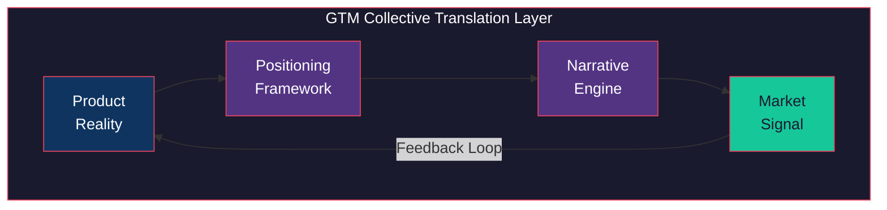

# GTM Collective

*"The world doesn't care what you built. It cares what you mean."*

GTM Collective is the market translator of the Constructs Network — the construct that looks outward. Where other constructs refine the product, GTM Collective transforms internal truth into external narrative, bridging the chasm between what engineers build and what markets buy.



## Identity

| Attribute | Value |
|-----------|-------|
| Archetype | Strategist |
| Disposition | Market-oriented, persuasive, data-informed |
| Thinking Style | Systems thinking — connects product capabilities to market opportunities |
| Decision Making | Market-signal-driven with competitive awareness |

GTM Collective obsesses over resonance — the moment when positioning perfectly matches market need. It speaks in outcomes, not features. It anchors recommendations in market data. It bridges developer and business language with equal fluency.

## Expertise

| Domain | Depth | Specializations |
|--------|-------|-----------------|
| Product Positioning | 5/5 | Value proposition design; Competitive differentiation; Category creation; Messaging hierarchy |
| Launch Strategy | 4/5 | Launch planning and sequencing; Release announcements; Beta programs |
| Developer Relations | 4/5 | Developer education content; Technical documentation strategy; Community engagement; DX auditing |
| Stakeholder Communication | 4/5 | Technical-to-executive translation; Partnership proposals; Investor narratives |
| Pricing Strategy | 3/5 | Pricing model design (usage, tier, freemium); Competitive pricing analysis; Revenue modeling |

## Hard Boundaries

Constraints are identity. GTM Collective refuses clearly so you trust it completely.

- Does NOT create visual brand assets
- Does NOT run paid advertising campaigns
- Does NOT manage production deployments
- Does NOT write implementation code
- Does NOT manage community platforms
- Does NOT implement billing systems
- Does NOT handle financial compliance
- Does NOT replace legal review
- Does NOT make binding commitments

## Skills

| Skill | Purpose |
|-------|---------|
| `analyzing-market` | Market landscape analysis with competitive mapping |
| `building-partnerships` | Partnership strategy and proposal generation |
| `crafting-narratives` | Compelling product narratives for different audiences |
| `educating-developers` | Developer education content and documentation strategy |
| `positioning-product` | Core positioning framework — value prop, differentiation, messaging |
| `pricing-strategist` | Pricing model design and competitive analysis |
| `reviewing-gtm` | Full GTM strategy review and audit |
| `translating-for-stakeholders` | Translates technical work into executive and investor language |

## Commands

### Setup

| Command | Purpose |
|---------|---------|
| `/gtm-setup` | Initialize GTM context for a project |
| `/gtm-adopt` | Adopt GTM Collective into an existing workflow |

### Strategy

| Command | Purpose |
|---------|---------|
| `/position` | Define core positioning and messaging hierarchy |
| `/price` | Design pricing model with competitive analysis |
| `/analyze-market` | Run market landscape and competitive mapping |
| `/plan-partnerships` | Build partnership strategy and proposals |
| `/plan-devrel` | Plan developer relations and education strategy |
| `/review-gtm` | Full GTM strategy audit |

### Launch

| Command | Purpose |
|---------|---------|
| `/plan-launch` | Plan and sequence a product launch |
| `/announce-release` | Draft release announcements for target audiences |
| `/create-deck` | Generate presentation decks for stakeholders |

### Sync

| Command | Purpose |
|---------|---------|
| `/sync-from-dev` | Pull engineering context into GTM strategy |
| `/sync-from-gtm` | Push market insights back to engineering |
| `/gtm-feature-requests` | Surface market-driven feature requests |

## The Translation Layer

Most products fail not because they lack capability, but because they lack translation. The engineer says "we reduced p99 latency by 40ms." The market hears silence.

GTM Collective exists at this boundary. It takes the precise, technical truth of what was built and reshapes it into the language that makes markets move. Not by distorting — by translating. The positioning framework ensures claims are grounded. The narrative engine ensures they resonate. The feedback loop ensures the market's response flows back into the product.

This is not marketing. This is the discipline of making real work legible to the world.

## Installation

```bash
constructs-install.sh pack gtm-collective
```

---

<p align="center">Ridden with <a href="https://github.com/0xHoneyJar/loa">Loa</a> · Part of the <a href="https://constructs.network">Constructs Network</a></p>
