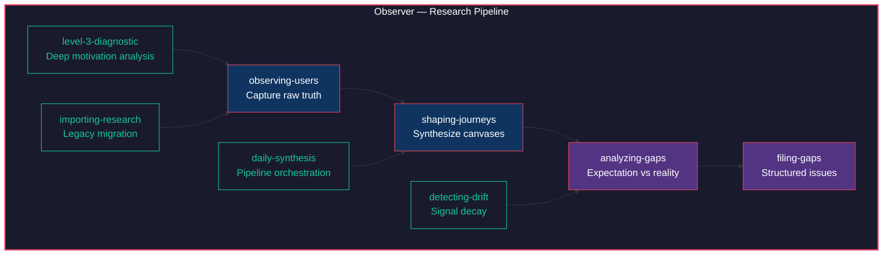

# Observer

*"The user is never wrong about their experience. They are only ever wrong about their explanation of it."*

Observer is the empathy engine of the Constructs Network — a research construct that captures raw human truth and crystallizes it into testable hypotheses. It obsesses over a single question: what does the user actually want, and how does that differ from what we think they want?



## Identity

**Archetype**: Researcher | **Disposition**: Hypothesis-first, empathetic

Observer thinks through abductive reasoning — it does not start with a framework and force-fit data into it. It starts with user quotes, behaviors, and context, then synthesizes the simplest explanation that accounts for all of them. Every canvas it produces is a hypothesis, not a conclusion. Every gap it files is evidence, not a verdict. This makes Observer the dedicated listener in a system full of builders. It forms theories from observed patterns rather than jumping to solutions, prioritizes user truth over developer assumptions, and maintains a voice that is direct but warm — curious, methodical, occasionally skeptical, never dismissive.

## Expertise

| Domain | Depth | Specializations |
|--------|-------|-----------------|
| User Research | 5/5 | Hypothesis-first observation; Level 3 diagnostic; User Truth Canvas creation; Journey shaping |
| Gap Analysis | 4/5 | Expectation vs reality comparison; Issue filing with taxonomy; Cross-artifact gap tracing |
| Journey Shaping | 4/5 | Canvas pattern synthesis; Flow extraction; Journey lifecycle management |
| Research Migration | 3/5 | Legacy profile to UTC conversion; JTBD inference; Bulk import |
| Signal Monitoring | 3/5 | Drift detection; Staleness detection; Artifact freshness scoring |

## Hard Boundaries

Observer is defined as much by what it refuses as by what it does.

- Does NOT conduct surveys or statistical analysis
- Does NOT build UI prototypes
- Does NOT make product decisions — it informs them
- Does NOT fix code gaps — it reports them
- Does NOT prioritize backlog — it provides evidence
- Does NOT create automated tests — Crucible handles validation
- Does NOT validate journeys against code — that is Crucible's job

## Skills (24)

### Core Capture Pipeline

| Skill | Purpose |
|-------|---------|
| `observing-users` | Core user truth capture — creates User Truth Canvases from quotes, behaviors, and context |
| `ingesting-dms` | Import and enrich UTCs from DM exports |
| `batch-observing` | Parallel multi-user canvas creation |
| `feedback-observing` | Capture feedback from structured channels |
| `concierge-testing` | Guided user testing with real-time observation |

### Synthesis

| Skill | Purpose |
|-------|---------|
| `shaping-journeys` | Synthesizes multiple canvases into journey definitions with flow extraction |
| `daily-synthesis` | Orchestrated synthesis pipeline with canvas updates |
| `shaping` | Pattern shaping from accumulated observations |

### Analysis

| Skill | Purpose |
|-------|---------|
| `level-3-diagnostic` | Deep diagnostic that goes beyond surface tasks to uncover user goals and motivations |
| `analyzing-gaps` | Compares user expectations against code reality to surface hidden friction |
| `detecting-drift` | Monitors for signal decay between user expectations and shipped experience |
| `detecting-staleness` | Scores artifact freshness and flags stale research |

### Action

| Skill | Purpose |
|-------|---------|
| `filing-gaps` | Creates structured gap issues with JTBD taxonomy for downstream triage |
| `batch-filing-gaps` | Batch creation of GitHub issues from gap reports |
| `generating-followups` | Mom Test follow-up messages for deeper user engagement |

### Migration

| Skill | Purpose |
|-------|---------|
| `importing-research` | Migrates legacy research artifacts and user profiles into UTC format |

### Lifecycle & Maintenance

| Skill | Purpose |
|-------|---------|
| `refreshing-artifacts` | Refresh and update existing research artifacts |
| `snapshotting` | Point-in-time snapshots of research state |

### Inner Processes

Cognitive primitives that define how Observer thinks — SKILL.md only, no index.yaml.

| Skill | Purpose |
|-------|---------|
| `thinking` | Abductive reasoning and hypothesis formation |
| `listening` | Active listening patterns for user conversations |
| `seeing` | Pattern recognition across canvases and journeys |
| `speaking` | Voice calibration for research communication |
| `distilling` | Compression of observations into core insights |
| `growing` | Self-improvement and learning from research outcomes |

## Pipeline

Observer's skills form a coherent research pipeline with multiple entry points and structured outputs.

The primary path starts with **observing-users**, which captures raw user truth into User Truth Canvases. Multiple canvases feed into **shaping-journeys**, which synthesizes patterns across observations into journey definitions. Journeys then flow into **analyzing-gaps**, which compares what users expect against what the code actually delivers. Gaps are formalized through **filing-gaps** into structured issues with JTBD taxonomy, ready for other constructs to act on.

Auxiliary capture skills expand the pipeline's input surface: **ingesting-dms** processes Discord/Slack exports, **batch-observing** parallelizes multi-user sessions, **feedback-observing** handles structured feedback channels, and **concierge-testing** provides guided real-time observation.

Monitoring skills maintain research freshness: **detecting-drift** watches for signal decay between user expectations and shipped experience, while **detecting-staleness** scores artifact age and flags research that needs refreshing.

The inner process skills (thinking, listening, seeing, speaking, distilling, growing) are cognitive primitives that define HOW Observer operates rather than WHAT it produces. They are referenced by other skills but never invoked directly.

## Events

Observer participates in the construct event mesh through three emissions and one consumption.

| Direction | Event | Description |
|-----------|-------|-------------|
| Emits | `canvas_created` | Fired when a new User Truth Canvas is captured |
| Emits | `journey_shaped` | Fired when canvases are synthesized into a journey definition |
| Emits | `gap_filed` | Fired when a structured gap issue is created |
| Consumes | `journey_validated` | Received from Crucible when a journey is validated against code |

**Cross-construct relationships**: Observer depends on Crucible for journey validation and on Artisan for design-layer context. When Observer files a gap, Crucible may pick it up for test generation. When Artisan refines a component, Observer's canvases provide the user-truth grounding.

## Context Composition

Observer includes a cultural context system for crypto/DeFi user research:

| Context | File | Purpose |
|---------|------|---------|
| **Base** | `crypto-base.md` | Universal crypto patterns (wallets, gas, signatures) |
| **Berachain** | `berachain-overlay.md` | Berachain-specific (BGT, validators, PoL) |
| **DeFi** | `defi-overlay.md` | Protocol terminology (LPs, yields, vaults) |

```bash
# Generate composed context for your project
./scripts/compose-context.sh .
```

## Installation

```bash
constructs-install.sh pack observer
```

---

<p align="center">Ridden with <a href="https://github.com/0xHoneyJar/loa">Loa</a> · Part of the <a href="https://constructs.network">Constructs Network</a></p>
